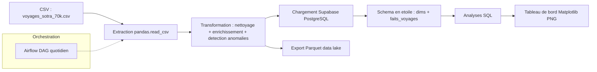

# Projet 5 — Pipeline ETL Transport SOTRA (Côte d'Ivoire)

## 1\. Description du projet

Ce projet met en place un pipeline de données complet (ETL) pour analyser la fréquentation du réseau de bus **SOTRA** à Abidjan. Il couvre la génération d'un jeu de données réaliste (70 000 voyages), le nettoyage et l'enrichissement des données, la détection d'anomalies, le chargement dans une base **Supabase (PostgreSQL)** organisée en **schéma en étoile**, des analyses SQL, un tableau de bord et l'orchestration via **Apache Airflow**.

## 2\. Architecture du pipeline




## 3\. Technologies utilisées

|Catégorie|Outils|
|-|-|
|Langage|Python 3.11|
|Manipulation de données|pandas, numpy|
|Base de données|Supabase (PostgreSQL)|
|Connexion DB|SQLAlchemy, psycopg2|
|Stockage data lake|Parquet (pyarrow)|
|Visualisation|Matplotlib|
|Orchestration|Apache Airflow|
|Conteneurisation|Docker, docker-compose|
|Notebook|Jupyter / Google Colab|

## 4\. Structure du repository

```
projet5-sotra/
├── README.md
├── PROJET\_DATA\_ENGINEERING\_V2.ipynb   # Pipeline ETL complet, annoté
├── requirements.txt
├── Dockerfile
├── docker-compose.yml
├── .env.example
├── .gitignore
└── dags/
    └── sotra\_pipeline\_dag.py          # DAG Airflow (4 tâches)
```

## 5\. Instructions pour reproduire le projet

### a) Avec Google Colab (recommandé pour le notebook)

1. Ouvrir `PROJET\_DATA\_ENGINEERING\_V2.ipynb` dans Google Colab.
2. Renseigner vos identifiants Supabase dans la cellule de connexion (variable `SUPABASE\_DB\_URL`).
3. **Runtime → Exécuter tout** : le notebook génère le dataset, nettoie les données, détecte les anomalies, peuple le schéma en étoile, exécute les analyses SQL et génère le tableau de bord.

### b) Avec Docker (environnement local complet)

```bash
# 1. Cloner le repo
git clone <url-du-repo>
cd projet5-sotra

# 2. Configurer les variables d'environnement
cp .env.example .env
# puis renseigner SUPABASE\_DB\_URL dans .env

# 3. Lancer les services (notebook + Airflow)
docker-compose up --build
```

* Le notebook Jupyter est accessible sur `http://localhost:8888`
* L'interface Airflow est accessible sur `http://localhost:8080`
* Le DAG `sotra\_pipeline\_quotidien` (4 tâches : extraction → transformation → chargement → rapport) est automatiquement détecté dans `dags/`

## 6\. Résultats clés (KPI)

|KPI|Valeur|
|-|-|
|Taux de remplissage moyen (toutes lignes)|\~47,5 %|
|Taux de remplissage moyen en heure de pointe (7h-8h, 17h-19h)|\~74 %|
|Taux d'incident moyen par ligne|\~5 %|
|Ligne la plus chargée|L5 Abobo-Adjame (47,81 % de remplissage moyen)|
|Volume total de voyages analysés|70 000 (avant nettoyage)|

## 7\. Outils d'IA utilisés

(Claude) structuration du DAG Airflow, aide pour la correction d"erreur.

## 8\. Auteurs

* Membre 1 — ODI JONATHAN DELON
* Membre 2 — KOUASSI CEPHAS

